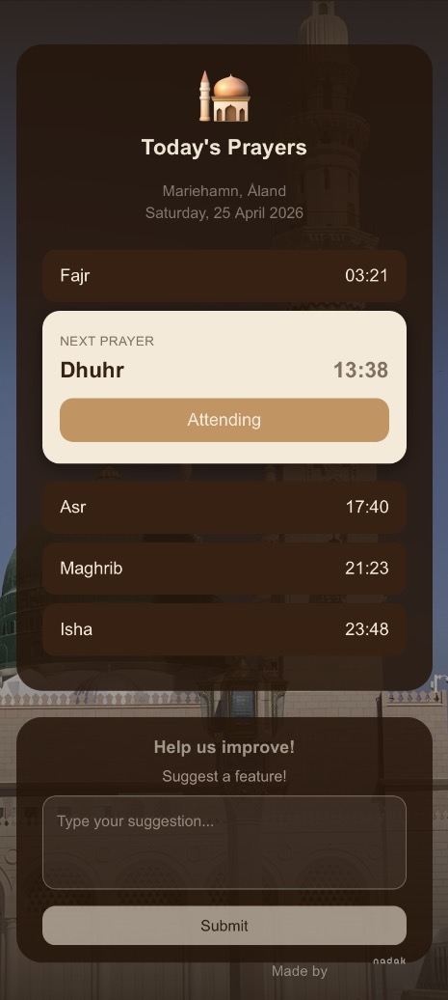
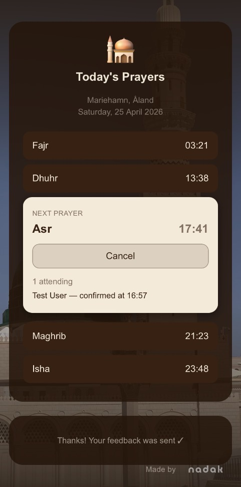
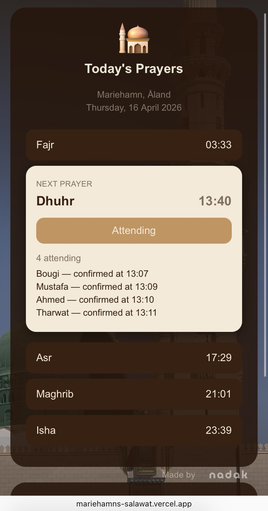

# Mariehamns Salawat
A mobile-first web app that helps a small mosque group coordinate daily prayers.

## Problem
A local mosque group of 12–13 people coordinates their five daily prayers entirely through WhatsApp. Before each prayer, someone has to manually message or call the others to check who's attending. With no clear picture of who's coming, they sometimes fail to reach the minimum of 3 people required for jama'ah. Prayer times also vary between individuals depending on which app or settings they use, adding further confusion.

## Solution
Mariehamns Salawat is a simple, mobile-first web app that centralises prayer coordination in one place. It shows a single unified prayer timetable for the day, pulled live from the Aladhan API. For each prayer, any member can tap "I'm attending" to confirm their presence. Everyone in the group sees the attendee count update in real time, so that there are no messaging, no calling, no guessing.


## Live Demo
[mariehamns-salawat.vercel.app](https://mariehamns-salawat.vercel.app)

## Screenshots

### First Screen


### Welcoming Screen


### Home Screen


### Attending & Form Submission


### Real User Testing


## Tech Stack
- **Frontend:** Next.js (App Router, mobile-first)
- **Styling:** Tailwind CSS
- **Backend / Realtime:** Supabase (PostgreSQL + Realtime subscriptions)
- **Database:** PostgreSQL via Supabase
- **Prayer Times API:** Aladhan (free, no key required)
- **Deployment:** Vercel

## How to Run Locally
1. **Clone the repo**
```bash
   git clone https://github.com/zinebnadak/mosque-prayer-coordinator.git
   cd mosque-prayer-coordinator
```
2. **Install dependencies**
```bash
   npm install
```
3. **Set up environment variables**

   Copy the example file and fill in your Supabase credentials:
```bash
   cp .env.example .env.local
```

4. **Navigate to the app folder & run the development server**
```bash
   npm run dev
```
   Open [http://localhost:3000](http://localhost:3000) on your phone or browser.

## Development Process
Lean Agile + Kanban — [View Board](https://github.com/users/zinebnadak/projects/3)

## What I Learned
Using API to display accurate prayer-times. Skipping authentication for MVP meant thinking carefully about how to identify users without accounts. Storing a name in localStorage and tying it to attendance records was simple but enough for a trusted private group. Supabase realtime just worked. Live updates across devices required surprisingly little code...

I got really great feedback, so adding a Feedback form is always worth is for small builds like these with real users! :)

## Roadmap
What comes next...
